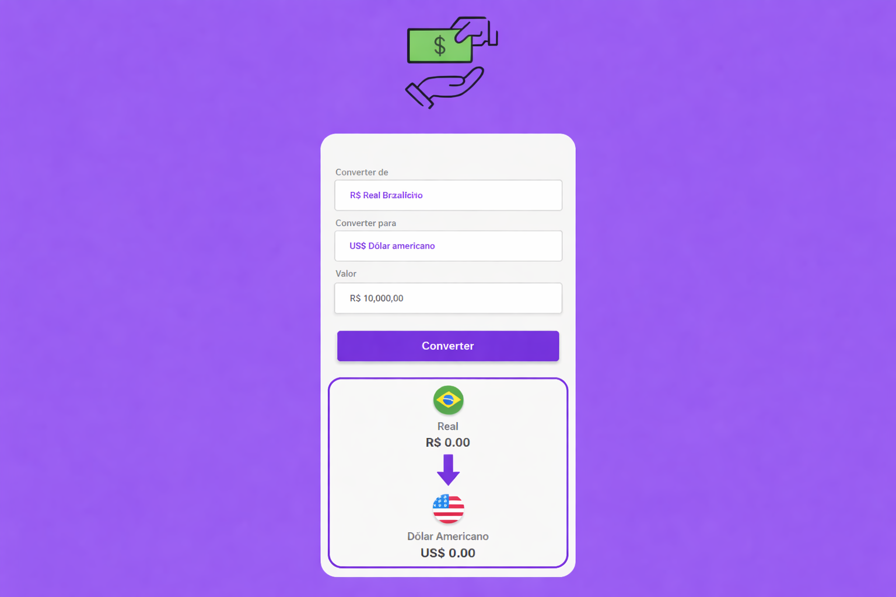

# 💱 Conversor de Moedas

Um conversor de moedas moderno e funcional desenvolvido com **HTML, CSS e JavaScript**, permitindo converter valores entre diferentes moedas com uma interface simples e intuitiva.

---

## 🖼️ Preview do projeto




---

## 🚀 Funcionalidades

* Conversão entre:

  * 🇧🇷 Real (BRL)
  * 🇺🇸 Dólar (USD)
  * 🇪🇺 Euro (EUR)
  * ₿ Bitcoin (BTC)
* Validação para impedir conversão entre moedas iguais
* Validação de valor inválido
* Atualização dinâmica de bandeiras e nomes
* Formatação automática de valores monetários
* Interface inspirada em aplicativos mobile

---

## 🛠️ Tecnologias utilizadas

* HTML5
* CSS3
* JavaScript (Vanilla JS)

---

## 📂 Estrutura do projeto

```
📁 conversor-de-moedas
├── 📁 assets
│   ├── 📁 img
│       ├── Brasil.png
│       ├── Eua.png
│       ├── euro.png
│       └── bitcoin.png
│       └── preview.png
├── index.html
├── styles.css
└── script.js
```

---

## ⚙️ Como funciona

### 🔁 Lógica de conversão

O sistema utiliza o Real (BRL) como base:

1. Converte a moeda de origem para Real
2. Converte de Real para a moeda destino

```
const valorEmReal = inputValue * rates[moedaOrigem]
const valorFinal = valorEmReal / rates[moedaDestino]
```

---

### 💰 Taxas de conversão

```
const rates = {
    real: 1,
    dolar: 5.10,
    euro: 5.96,
    bitcoin: 0.0000047
}
```

> ⚠️ As taxas são fixas (não atualizam automaticamente)

---

### ✅ Validações

Evita moedas iguais:

```
if (select1.value === select2.value) {
    alert("Selecione moedas diferentes para converter")
    return
}
```

Evita valores inválidos:

```
if (!inputValue || inputValue <= 0) {
    alert("Digite um valor válido")
    return
}
```

---

### 🌍 Formatação de valores

Utiliza a API `Intl.NumberFormat`:

```
new Intl.NumberFormat("pt-BR", {
    style: "currency",
    currency: "BRL"
}).format(value)
```

Bitcoin:

```js
value.toFixed(8) + " BTC"
```

---

## 🎨 Interface

* Layout centralizado
* Design limpo e moderno
* Botão com efeito hover
* Uso de sombras e bordas suaves
* Exibição visual com bandeiras

---

## 📈 Melhorias futuras

* 🔄 Integração com API de cotação em tempo real
* 📱 Melhor responsividade
* 🌙 Dark mode
* 🔁 Botão de inverter moedas
* 📊 Histórico de conversões

---


---

## 👨‍💻 Autor

Desenvolvido por **Ewerthon Gomes**

---

## 📄 Licença

Este projeto está sob a licença MIT.
